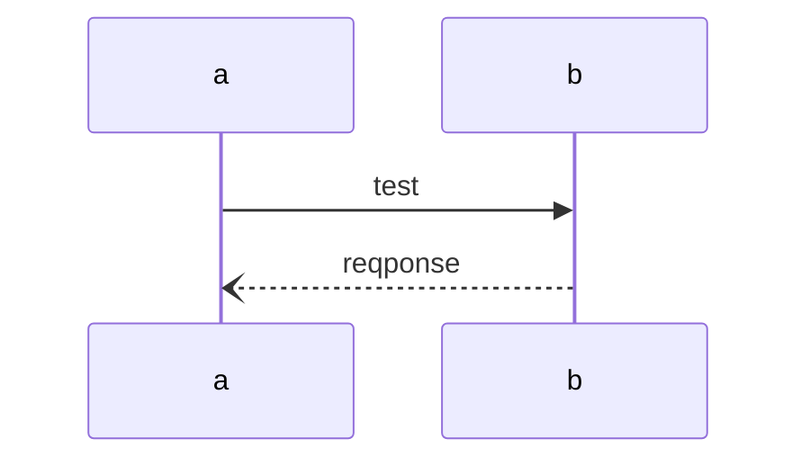

# Tags

태그 문법 : "\{% 태그명 %\} 내용 \{% end태그명 %\}"

## Tab

> \{% tabs %\}
>
> \{% tab title="tab1" %\} tab1 content \{% endtab %\}
>
> \{% tab title="tab2" %\} tab2 content \{% endtab %\}
>
> \{% endtabs %\}



tab1 content



tab2 content



## Hint

> \{% hint style="info" %\} hint text \{% endhint %\}


hint text


## Card

```
<table data-view="cards">
  <thead> <tr> <th></th> <th></th> <th></th> </tr> </thead>
  <tbody>
    <tr> <td></td> <td>Card1</td> <td></td> </tr>
    <tr> <td></td> <td>Card2</td> <td></td> </tr>
    <tr> <td></td> <td>Card3</td> <td></td> </tr>
  </tbody>
</table>
```

<table data-view="cards"><thead><tr><th></th><th></th><th></th></tr></thead><tbody><tr><td></td><td>Card1</td><td></td></tr><tr><td></td><td>Card2</td><td></td></tr><tr><td></td><td>Card3</td><td></td></tr></tbody></table>

## Expended

```
<details>
  <summary>title</summary>
  content
</details>
```

<details>

<summary>title</summary>

content

</details>

## API(Swagger)

> \{% swagger method="get" path="" baseUrl="https://test.com" summary="summary" %\}
>
> \{% swagger-description %\} description(opt) \{% endswagger-description %\}
>
> \{% swagger-parameter in="path" name="path\_param" type="string" required="false" %\} desc. \{% endswagger-parameter %\}
>
> \{% swagger-parameter in="query" name="query\_parma" required="false" %\} desc. \{% endswagger-parameter %\}
>
> \{% swagger-response status="200: OK" description="desc" %\}
>
> ```javascript
>
> {
>
>     // Response body
>     
> }
>
> ```
>
> \{% endswagger-response %\}
>
> \{% endswagger %\}



description(opt)



desc.



desc.



```javascript
{
    // Response body
}
```



## Math

```
$$ 
  f(x) = x * e^{2 pi i \xi x} 
$$
```

$$f(x) = x * e^{2 pi i \xi x}$$

## Mermaid
<pre>

</pre>


